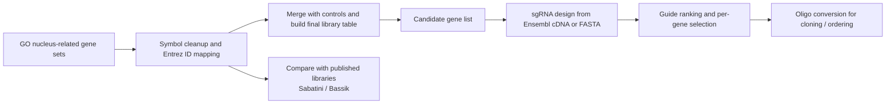

# Library-Construction

> A nucleus-focused CRISPR library construction workflow that connects GO-term curation, public-library comparison, guide design, and oligo ordering into one reproducible project.

## Overview

This repository records a complete workflow for building a custom CRISPR knockout library centered on nuclear genes. The pipeline starts from GO-derived candidate genes, maps symbols to stable gene identifiers, compares the resulting set with published libraries, designs candidate sgRNAs, and finally exports cloning-ready oligo sequences.

The current project materials include:

- a curated final library table with **6000 constructs**
- **5910 experimental constructs + 90 control constructs**
- R scripts for gene-set integration and library assembly
- Python scripts for sgRNA discovery, sequence conversion, and Venn-preparation utilities
- overlap figures against **Sabatini** and **Bassik** reference resources

## Workflow



## What Each Part Does

### 1. Candidate collection and library assembly

The main R workflow in [`R_code.R`](R_code.R) reads GO-derived TSV files, merges experimental and control components, maps symbols to Entrez IDs with `org.Hs.eg.db`, supplements unresolved entries with a manual mapping table, and exports the final library tables used downstream.

Representative outputs:

- `Intermediate_library1/constructs10_raw.csv`
- `Intermediate_library1/constructs9_raw.csv`
- `Intermediate_library1/control_constructs_raw.csv`
- `Intermediate_library1/Final_final.csv`

### 2. sgRNA design

Two complementary guide-design routes are provided:

- [`Python_code/guide.py`](Python_code/guide.py): queries Ensembl, retrieves canonical cDNA sequences, scans the first 500 bp, and keeps top NGG-compatible guides after GC and poly-T filtering.
- [`Python_code/guide_fasta.py`](Python_code/guide_fasta.py): parses local FASTA sequences, converts RefSeq IDs to gene symbols with `mygene`, then applies the same design logic.

Design heuristics used in the scripts:

- scan the first **500 bp**
- retain **20 nt** spacer candidates with **NGG PAM**
- discard guides containing `TTTT`
- keep GC content between **40% and 80%**
- rank candidates by proximity to **55% GC**

### 3. Oligo ordering

[`Python_code/trans.py`](Python_code/trans.py) converts selected guide sequences into cloning-ready oligos by appending forward and reverse adapters compatible with typical CRISPR cloning workflows.

Main output:

- `Python_code/Oligo_Order_Form.csv`

### 4. Public-library overlap analysis

The script `Python_code/#101926&#101928.py` extracts Ensembl IDs from Addgene/Bassik-style guide names and prepares Venn inputs for overlap analysis against external libraries.

## Repository Layout

```text
.
├── R_code.R
├── Library1.csv
├── Intermediate_library1/       # curated tables and intermediate library outputs
├── Library2/                    # public-library comparison inputs + Venn figures
├── Python_code/                 # guide design, FASTA processing, oligo export
└── R_intermediate_code/         # stepwise R scripts used during library assembly
```

## Key Files

| File | Role |
| --- | --- |
| `R_code.R` | Main library-construction script from GO terms to final construct table |
| `Python_code/guide.py` | Canonical-transcript-based sgRNA design via Ensembl REST API |
| `Python_code/guide_fasta.py` | FASTA-based sgRNA design using RefSeq-to-symbol conversion |
| `Python_code/trans.py` | Convert guides into forward/reverse oligos for ordering |
| `Library2/sabatini.svg` | GO nucleus vs Sabatini nucleus overlap |
| `Library2/bassik.svg` | GO nucleus vs Bassik GEEX / ACOC overlap |

## Figures

<table>
  <tr>
    <td align="center">
      
      <br />
      <sub>Overlap between the GO nucleus gene set and the Sabatini nucleus collection.</sub>
    </td>
    <td align="center">
      
      <br />
      <sub>Overlap between the GO nucleus gene set and Bassik GEEX / ACOC sublibraries.</sub>
    </td>
  </tr>
</table>

## Reproducibility Notes

### R dependencies

- `readr`
- `dplyr`
- `stringr`
- `readxl`
- `org.Hs.eg.db`
- `AnnotationDbi`

### Python dependencies

- `pandas`
- `requests`
- `urllib3`
- `mygene`
- `biopython`

### Important note before rerunning

Several scripts contain **hard-coded absolute paths** pointing to the original local workspace. If you want to rerun the workflow on another machine, update those paths first.

## Suggested Entry Points

- Start with [`R_code.R`](R_code.R) if you want to understand how the final 6000-construct library was assembled.
- Start with [`Python_code/guide.py`](Python_code/guide.py) or [`Python_code/guide_fasta.py`](Python_code/guide_fasta.py) if your focus is guide design.
- Start with [`Python_code/trans.py`](Python_code/trans.py) if you only need the oligo-export step.
