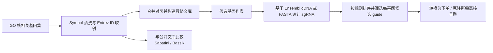
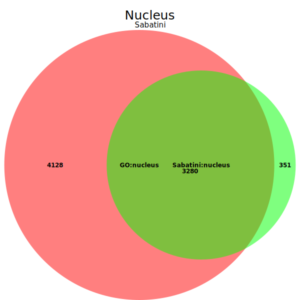
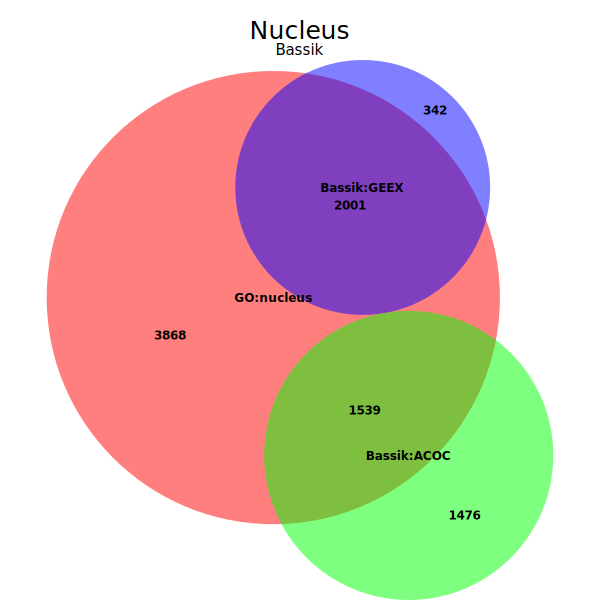

# Library-Construction

> 一个聚焦细胞核相关基因的 CRISPR 文库构建项目，串联了 GO 基因集整理、公共文库交叉比对、sgRNA 设计与寡核苷酸下单准备。

## 项目简介

本仓库记录了一套完整的 CRISPR 敲除文库构建流程。项目从 GO 术语筛选得到候选基因开始，完成基因符号到稳定 ID 的映射，与公开文库进行交叉比较，再进一步设计候选 sgRNA，最终导出适用于克隆和订购的寡核苷酸序列。

当前仓库中的核心结果包括：

- 一个包含 **6000 条 constructs** 的最终文库表
- **5910 条实验 constructs + 90 条对照 constructs**
- 用于基因集整合和文库组装的 R 脚本
- 用于 sgRNA 发现、FASTA 处理和序列转换的 Python 脚本
- 与 **Sabatini** 和 **Bassik** 文库的重叠分析图

## 流程概览



## 模块说明

### 1. 候选基因整理与文库组装

主流程位于 [`R_code.R`](R_code.R)。该脚本负责读取 GO 结果表、整合实验组与对照组数据、通过 `org.Hs.eg.db` 将 gene symbol 映射为 Entrez ID、对未命中的条目进行手工补充，并输出后续使用的文库表格。

代表性输出文件：

- `Intermediate_library1/constructs10_raw.csv`
- `Intermediate_library1/constructs9_raw.csv`
- `Intermediate_library1/control_constructs_raw.csv`
- `Intermediate_library1/Final_final.csv`

### 2. sgRNA 设计

仓库提供了两条互补的 guide 设计路径：

- [`Python_code/guide.py`](Python_code/guide.py)
  基于 Ensembl REST API 获取 canonical transcript 的 cDNA 序列，在前 500 bp 范围内搜索适合的 sgRNA。
- [`Python_code/guide_fasta.py`](Python_code/guide_fasta.py)
  直接解析本地 FASTA 文件，使用 `mygene` 将 RefSeq ID 映射为 gene symbol 后再执行同样的筛选逻辑。

脚本中使用的主要筛选规则：

- 仅扫描前 **500 bp**
- 保留带 **NGG PAM** 的 **20 nt spacer**
- 剔除包含 `TTTT` 的序列
- GC 含量控制在 **40% 到 80%**
- 按与 **55% GC** 的接近程度排序

### 3. 寡核苷酸下单准备

[`Python_code/trans.py`](Python_code/trans.py) 会将选中的 guide 序列转换为适合 CRISPR 克隆流程的正反向寡核苷酸序列，并补齐相应接头。

主要输出：

- `Python_code/Oligo_Order_Form.csv`

### 4. 公共文库重叠分析

脚本 `Python_code/#101926&#101928.py` 用于从 Addgene / Bassik 风格的 guide 命名中提取 Ensembl ID，并生成 Venn 分析所需的输入文件，方便与外部文库进行交叉验证。

## 仓库结构

```text
.
├── R_code.R
├── Library1.csv
├── Intermediate_library1/       # 中间表格、筛选结果和最终文库输出
├── Library2/                    # 公共文库比对输入与 Venn 图
├── Python_code/                 # sgRNA 设计、FASTA 处理、寡核苷酸导出
└── R_intermediate_code/         # 分步执行的 R 中间脚本
```

## 关键文件

| 文件 | 作用 |
| --- | --- |
| `R_code.R` | 从 GO 基因集到最终 constructs 表的主文库构建脚本 |
| `Python_code/guide.py` | 基于 Ensembl transcript 的 sgRNA 设计流程 |
| `Python_code/guide_fasta.py` | 基于本地 FASTA 的 sgRNA 设计流程 |
| `Python_code/trans.py` | 将 guide 转成可订购的正反向寡核苷酸 |
| `Library2/sabatini.svg` | GO nucleus 与 Sabatini nucleus 的重叠图 |
| `Library2/bassik.svg` | GO nucleus 与 Bassik GEEX / ACOC 的重叠图 |

## 图示

<table>
  <tr>
    <td align="center">
      
      <br />
      <sub>GO nucleus 基因集与 Sabatini nucleus 集合的重叠关系。</sub>
    </td>
    <td align="center">
      
      <br />
      <sub>GO nucleus 基因集与 Bassik GEEX / ACOC 子库的重叠关系。</sub>
    </td>
  </tr>
</table>

## 复现说明

### R 依赖

- `readr`
- `dplyr`
- `stringr`
- `readxl`
- `org.Hs.eg.db`
- `AnnotationDbi`

### Python 依赖

- `pandas`
- `requests`
- `urllib3`
- `mygene`
- `biopython`

### 重新运行前需要注意

仓库中的部分脚本保留了原始开发环境下的**绝对路径**。如果要在新的机器或新目录中复现，请先统一修改输入输出路径。

## 建议阅读顺序

1. 先看 [`R_code.R`](R_code.R)，理解 6000 条文库是如何组装出来的。
2. 如果重点关注 guide 设计，再看 [`Python_code/guide.py`](Python_code/guide.py) 和 [`Python_code/guide_fasta.py`](Python_code/guide_fasta.py)。
3. 如果只需要下单序列，则直接看 [`Python_code/trans.py`](Python_code/trans.py)。
